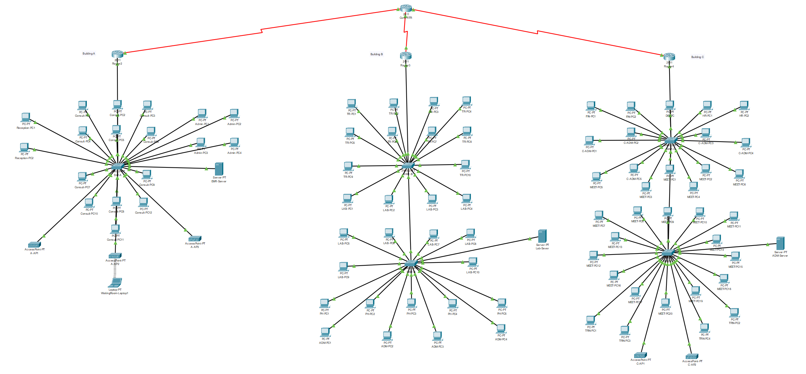
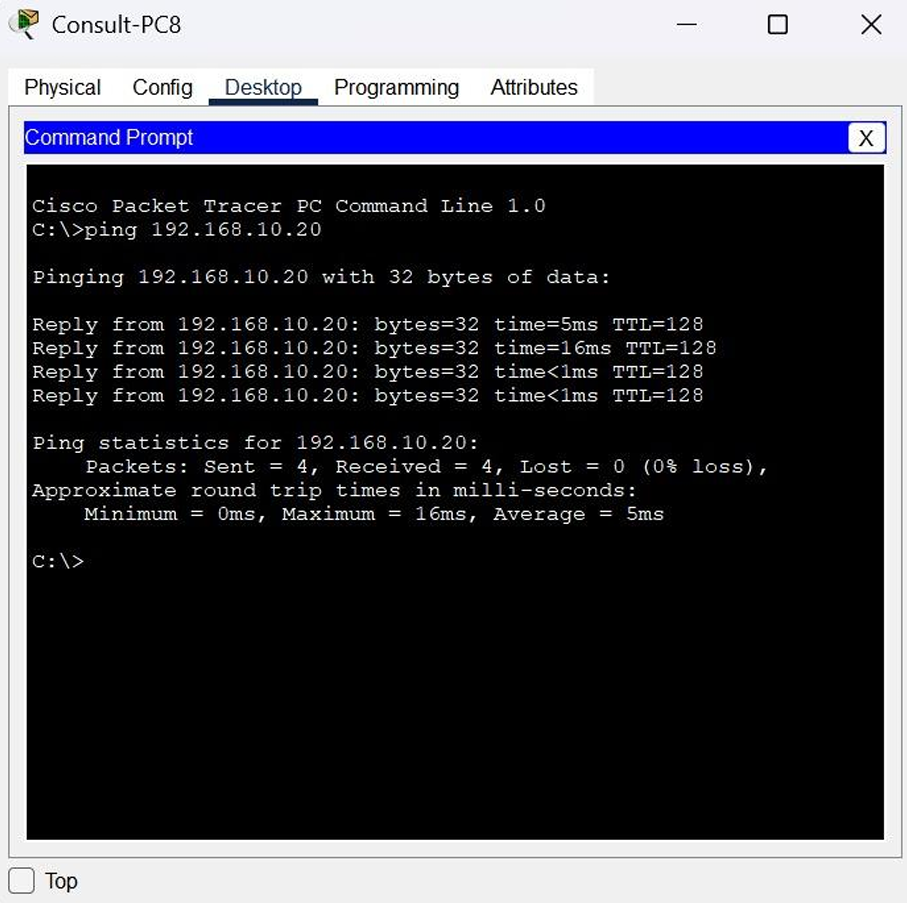
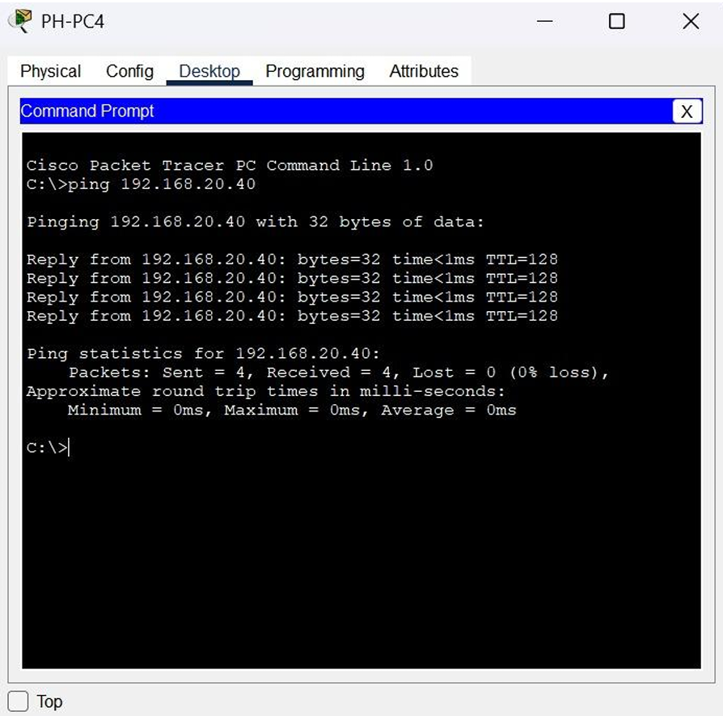
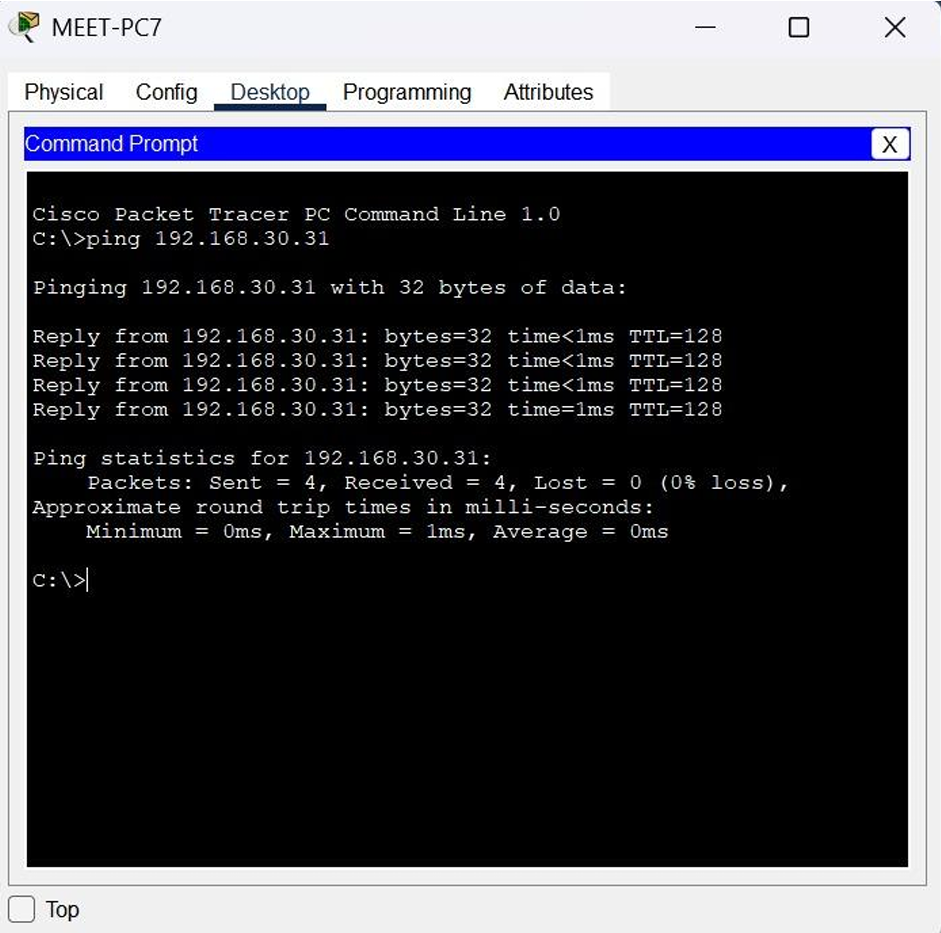

# Hospital Network Design

A complete hospital network infrastructure designed and simulated using Cisco Packet Tracer for a multi-building hospital environment.

---

## Project Overview

This project presents the design and implementation of a scalable hospital network connecting three separate buildings through a centralized core router architecture.

The network was designed to support:
- Outpatient clinics
- Laboratories
- Pharmacy systems
- Administrative departments
- Wi-Fi coverage
- Hospital servers

The infrastructure was simulated and tested using Cisco Packet Tracer before deployment.

---

## Features

- Multi-building network architecture
- Router and switch configuration
- WAN serial connections
- Static routing
- Wireless access point configuration
- IP subnetting
- DHCP support
- Server integration
- Inter-building communication
- Scalability support

---

## Technologies & Tools

- Cisco Packet Tracer
- Networking Fundamentals
- Routing & Switching
- WAN Technologies
- IP Addressing
- Static Routing
- DHCP
- Wireless Networking

---

## Network Architecture

The hospital consists of three connected buildings:

### Building A
- Outpatient clinics
- Reception
- EMR server
- Waiting area Wi-Fi

### Building B
- Treatment rooms
- Laboratories
- Pharmacy systems
- Lab server

### Building C
- Administration
- HR & Finance
- Conference rooms
- Staff café Wi-Fi
- Admin server

All buildings are connected through a central Core Router using serial WAN links.

---

## Devices Used

### Routers
- Cisco 2911 Routers

### Switches
- Cisco 2960 Switches

### Wireless Devices
- Access Points

### Servers
- EMR Server
- Lab Server
- Administrative Server

---

## IP Addressing Plan

| Building | Network Address | Subnet Mask | Gateway |
|---|---|---|---|
| Building A | 10.10.10.0 | 255.255.255.0 | 10.10.10.1 |
| Building B | 10.10.20.0 | 255.255.255.0 | 10.10.20.1 |
| Building C | 10.10.30.0 | 255.255.255.0 | 10.10.30.1 |

---

## Routing Configuration

The network uses:
- Static routing
- Serial WAN links
- DCE/DTE connections
- Core router architecture

Each building router connects to the core router using dedicated WAN subnets.

---

## Connectivity Testing

Network functionality was verified using:
- Ping tests
- Inter-building communication tests
- Router interface verification
- End-to-end connectivity testing

---

## Scalability

The network design supports future expansion through:
- Additional switches
- Extra WAN interfaces
- More wireless access points
- Additional buildings
- Server upgrades

---

# Screenshots

## Final Network Topology


---

## Building A Connectivity Test


---

## Building B Connectivity Test


---

## Building C Connectivity Test


---

## Project Structure

```txt
hospital-network-design/
│
├── README.md
├── packet-tracer/
├── screenshots/
└── Project report PDF
